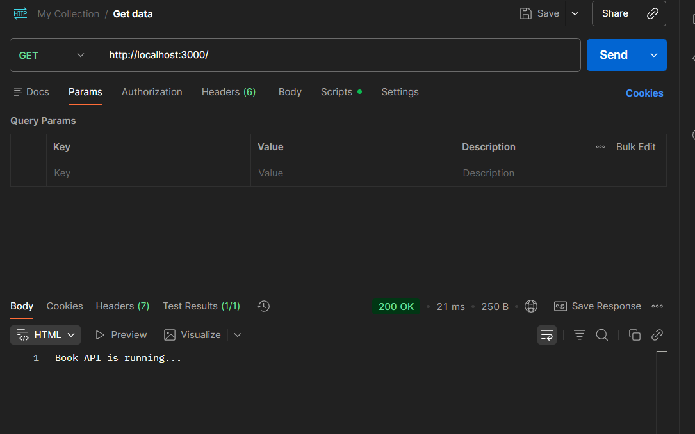
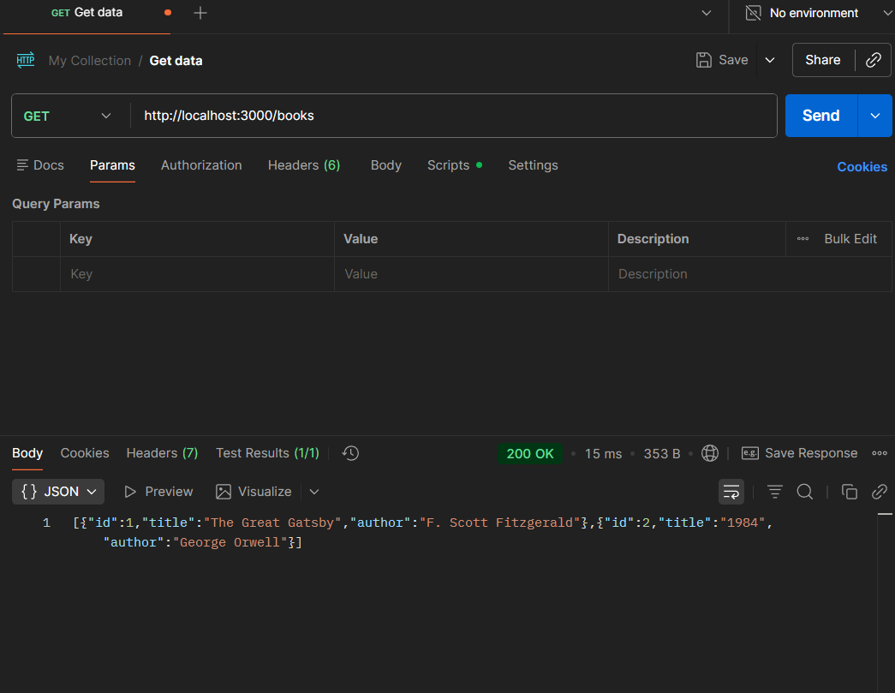
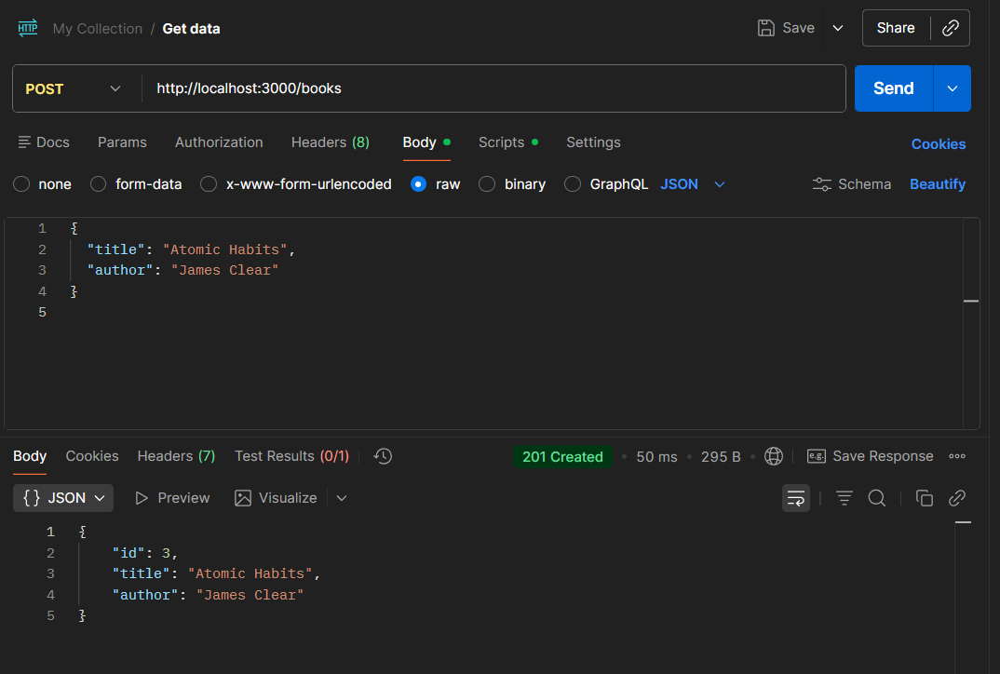
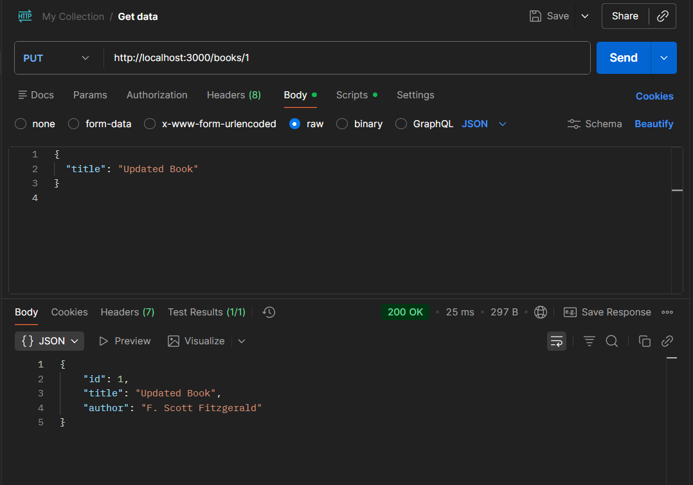
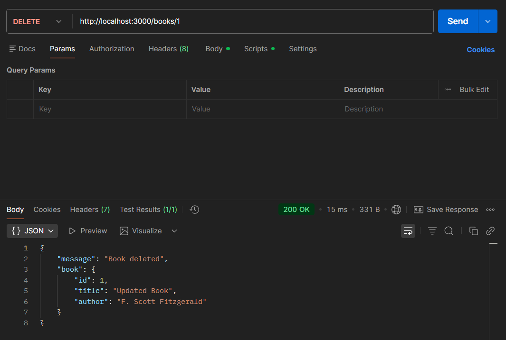

# Books REST API (Node + Express)

Minimal Node.js + Express REST API that stores an in-memory list of books (no database).

Prerequisites

- Node.js 14+ and `npm`

Install

```bash
npm install
```

Run

- Start the server: `npm start`
- Dev mode: `npm run dev` (requires `nodemon`)
- Default port: `3000` (set `PORT` to override)

Endpoints

- `GET /` — root health check (returns a short text message)
- `GET /books` — list all books (JSON array)
- `GET /books/:id` — return a single book by numeric id
- `POST /books` — create a book (JSON body: `title` and `author` are required)
- `PUT /books/:id` — update a book (JSON body may include `title` and/or `author`)
- `DELETE /books/:id` — delete a book


```text
Server running on http://localhost:3000
```

Initial data (server ships with two books):

```json
[ { "id": 1, "title": "The Great Gatsby", "author": "F. Scott Fitzgerald" },
  { "id": 2, "title": "1984", "author": "George Orwell" } ]
```

List books (GET /books)

1. Create a new `GET` request to `http://localhost:3000/books` in Postman.
2. Send the request and view the response body.

Postman screenshots

Below are the screenshot images taken from Postman for quick reference (open them in the repo or Git client):

- Initial server / root: 

  Shows the server start message and the root health check response (`Book API is running...`).

- GET /books response: 

  Displays the books list returned by `GET /books` (initial two sample books).

- POST /books response: 

  Example Postman response body after creating a new book (`Brave New World`).

- PUT /books/:id response: 

  Shows the updated book returned by `PUT /books/2` with the new title.

- DELETE /books/:id response: 

  Confirms deletion with the API's `Book deleted` message and the deleted book payload.


Files
- [src/app.js](src/app.js) — Express server and route handlers
